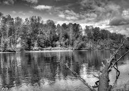
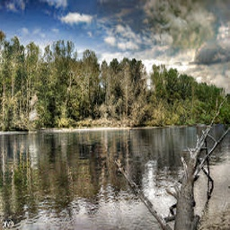

# Deep-Colorizer

Deep Colorizer is an application that is built with React and Flask that uses a Generative Advarsarial Network to colorize black and white images

## Examples
<table align="center">
  <tr>
    <td>  </td>
    <td> </td>
   </tr> 
   <tr>
      <td>  </td>
    <td> </td>
  </tr>
  <tr>
      <td>  </td>
    <td> </td>
  </tr>
</table>

## Demo

<p align="center">

</p>

## Getting Started

[Client](https://github.com/Atul-Acharya-17/Deep-Colorizer/tree/master/client/web)
```bash
cd client/web
npm install
npm start
```

[Server](https://github.com/Atul-Acharya-17/Deep-Colorizer/tree/master/server)
```bash
cd server
pip install -r requirements.txt
python app.py
```
To colorize using the terminal type the following command

```bash
cd server
python colorize.py --input_file=PATH/TO/IMAGE output_file=PATH/TO/SAVE/IMAGE
```

[Training](https://github.com/Atul-Acharya-17/Deep-Colorizer/tree/master/training)
```bash
cd training
pip install -r requirements.txt
python __main__.py
```

